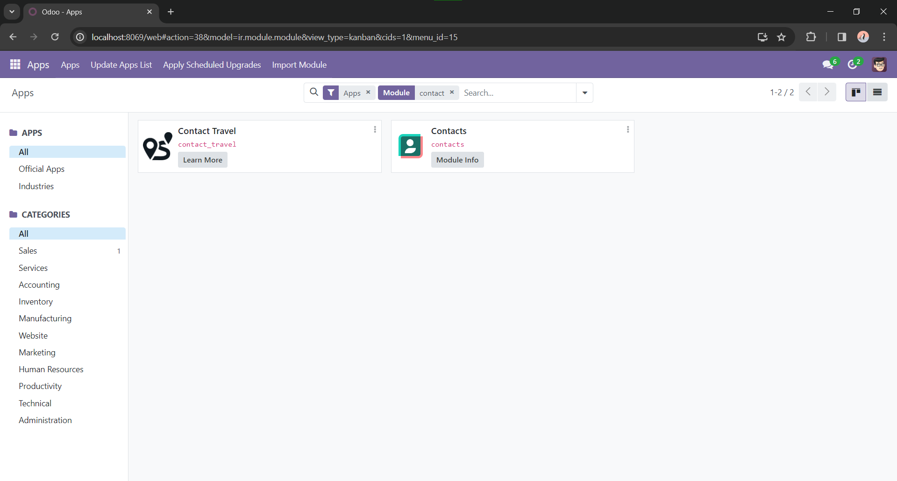
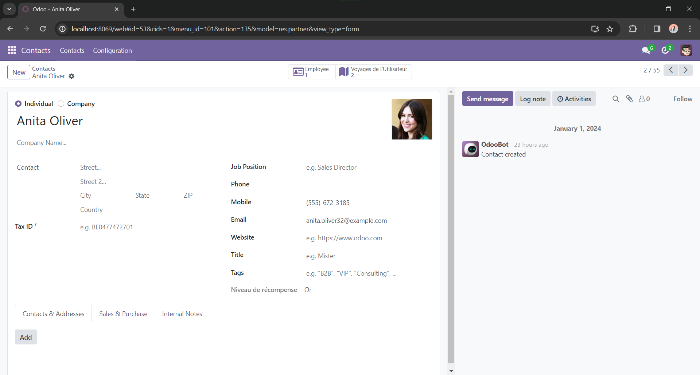

# Contact Travel

Contact Travel is an Odoo module to manage travels for contacts.

Screenshots:




## Tested with

- Odoo 17.0 Community
- PostgreSQL 16
- Python 3.10
- Windows 10 x64


## Getting started

To run this module:

- Clone the repo.

- Put it in your custom module folder.

- Assuming the database server is already running, execute the following:
```bat
REM 1.
venv\Scripts\activate

REM 2.
REM Append `-i contact_travel` to install it
REM     or `-u contact_travel` to update it if you make changes.
python odoo\odoo-bin -d contact_travel -c conf\odoo.conf -u contact_travel
```

- Visit http://localhost:8069/

- Install: **Contacts** app.

- Install: Search for "Contact Travel" and **activate** it.

- Done.


## Credits

- Icon from https://iconduck.com/icons/145760/route
